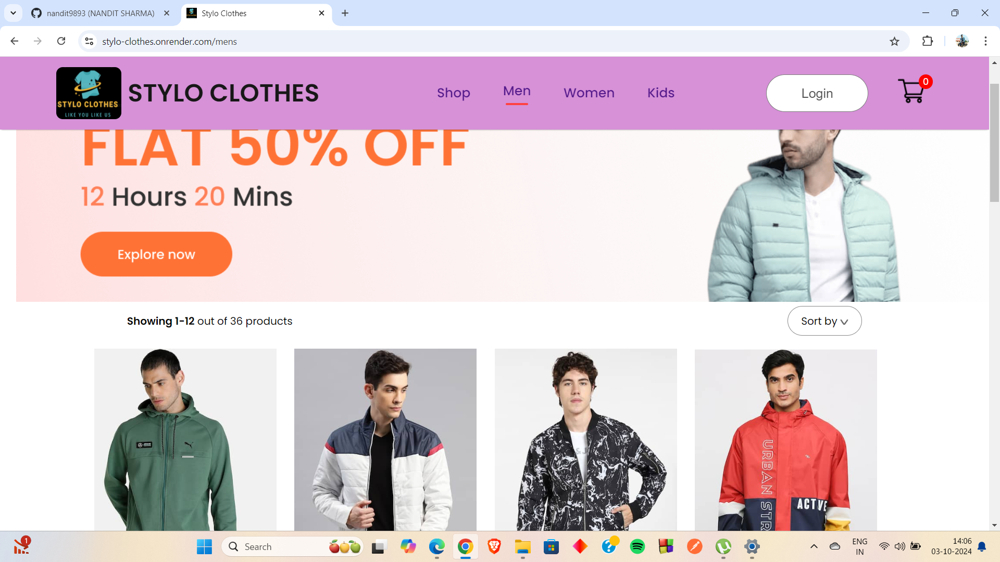
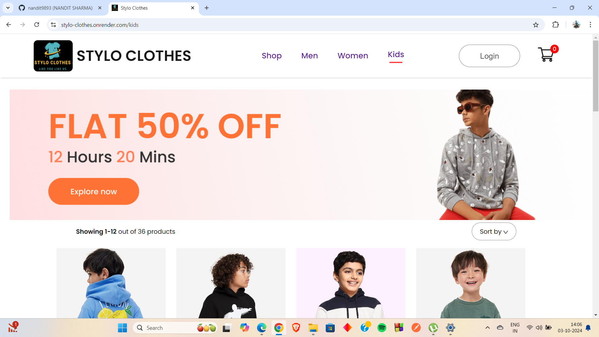
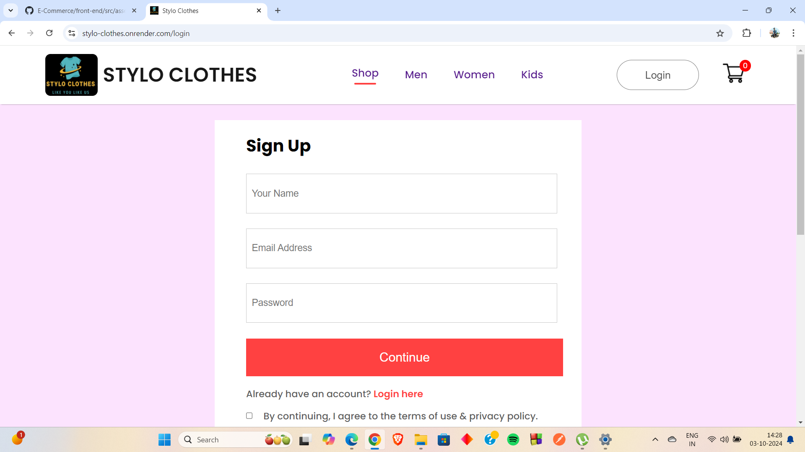

# MERN Stack E-Commerce Shopping Website with Admin Panel
  This project is a fully functional e-commerce shopping website developed using the MERN stack (MongoDB, Express.js, React.js, and Node.js) and includes an admin panel for managing products, orders, and users. The website features a user-friendly shopping interface, robust authentication, and essential e-commerce features. Below is a detailed overview of the application's features, including the admin panel, and the technologies used.

  **Visit**: https://stylo-clothes.onrender.com/

## Key Features
### **User Authentication**
- **Sign Up**:  Users can create a new account by providing necessary details such as username, email, and password to access personalized shopping features.
- **Log In**: Registered users can log in with their credentials. JSON Web Tokens (jsonwebtoken) are used for secure authentication and session management.

### Product Management
- **Product Listings**: Users can browse a wide range of products with details such as price, description, and images. Products are dynamically displayed with real-time updates from the MongoDB database.
- **Product Categories**: The website includes multiple categories to help users navigate and find products of interest.
- **Product Search:** Users can search for products by name, category, or keywords for a streamlined shopping experience.
- **Product Details Page:** Each product has a dedicated page displaying detailed information, reviews, and related items.

### Shopping Cart & Checkout
- **Add to Cart**: Users can add items to their cart with a single click. The cart dynamically updates as users add or remove products.
- **Cart Management**: Users can update the quantity of products or remove them from the cart.
- **Secure Checkout**: After reviewing their cart, users can proceed to the checkout, providing shipping information and making secure payments.

### Admin Panel
- **Dashboard**: The admin panel features a dashboard providing an overview of key website metrics such as total orders, total products, and user activity.
- **Product Management**: Admins can add, update, or remove products directly from the admin panel. They can manage product details such as name, price, category, and images.
- **Order Management**: Admins can view, update, and manage customer orders. This includes the ability to change order statuses (e.g., pending, shipped, delivered) and manage order details.
- **User Management**: Admins can view all registered users, block/unblock users, or delete accounts. The panel provides easy access to user details and order history.
- **Reports & Analytics**: Admins can view sales reports and customer behavior analytics to gain insights into website performance and make data-driven decisions.

### Responsive Design
- **All Devices**: The application is fully responsive, ensuring a smooth experience on both desktop and mobile devices. The design adapts seamlessly to different screen sizes, maintaining usability and accessibility for both users and admins.

## Technologies Used
### Frontend
 - **React**: The frontend is built using React, creating a dynamic and interactive user interface. Key components include Sign Up, Log In, Product Listings, Cart Pages, and the Admin Panel, all designed for an intuitive experience.
 - **CSS**:Custom CSS is applied to ensure that the website is visually appealing and consistent across different devices.

### Middleware
 - **Cors**:  CORS (Cross-Origin Resource Sharing) is enabled to allow smooth communication between the frontend and backend.
 - **Cookie-Parser**: This middleware is used to parse cookies, enabling the application to handle sessions and user authentication.

### Backend
 - **Node.js & Express.js**: The backend is built using Express.js, handling routing, authentication, API endpoints for product management, and user order details.
 - **MongoDB & Mongoose:**: MongoDB, a NoSQL database, is used to store product information, user data, order details, and more. Mongoose provides a schema-based solution to model the application data.

### Authentication & Security
 - **bcrypt**: Passwords are securely hashed using bcrypt, ensuring safe storage of user credentials.
 - **jsonwebtoken**: JWTs are used for secure authentication and session management across the application for both users and admins.

### File Uploads
 - **Multer & Cloudinary**: Multer handles file uploads (e.g., product images or user avatars), and Cloudinary is used to store and manage these files in the cloud for optimal performance.

### Development Tools
 - **Nodemon**: Nodemon is used during development to automatically restart the server when backend changes are made, speeding up development.
 - **Prettier**: Prettier is used for formatting the codebase, ensuring that the code remains clean, consistent, and easy to read.

## Conclusion
This e-commerce shopping website with an integrated admin panel demonstrates the comprehensive use of the MERN stack to create a modern, responsive, and secure shopping platform. With features for both customers and administrators, it offers seamless product browsing, cart management, and secure checkout functionality, along with robust tools for managing products, orders, and users. Whether accessed on desktop or mobile devices, the website provides an intuitive experience for all users.

# Website Images
## Webpages

## Popular in Women

## New Collections

## Footer

## Men Collections

## Women Collections

## Kids Collections

## Cart 

## Order

## Sign Up

## Login

